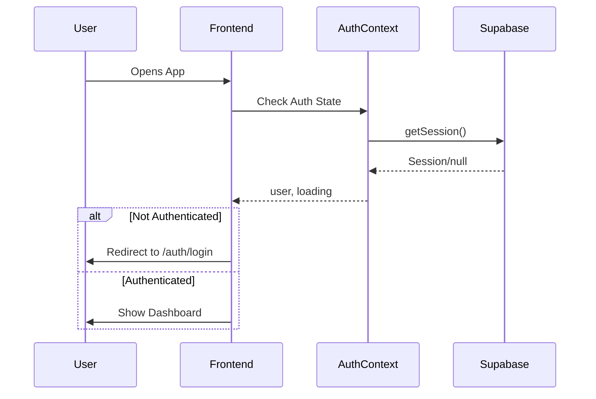

# 🚀 Bongo Porter

> **Peer-to-peer logistics marketplace connecting senders with local drivers for instant, affordable deliveries.**

## 💡 The Idea

Bongo Porter is an **Uber for deliveries** - a two-sided marketplace where:
- **Customers** can request instant package delivery at competitive prices
- **Drivers** can earn money by picking up and delivering packages on their routes

Think of it as combining the convenience of food delivery apps with the flexibility of ride-sharing - but for packages of any size.

## 🎯 Problem We're Solving

Traditional courier services are:
- ❌ Expensive (especially for same-day delivery)
- ❌ Slow (next-day at best for most)
- ❌ Inflexible (fixed schedules, no real-time tracking)
- ❌ Not optimized for short-distance local deliveries

**Bongo Porter** offers:
- ✅ **Instant pickup** - drivers nearby accept jobs in real-time
- ✅ **Live tracking** - see your package move on the map
- ✅ **Competitive pricing** - drivers bid on jobs, you choose
- ✅ **Two-way marketplace** - be a sender OR a driver (or both!)

## 📱 Features

### For Customers (Senders)
- 📦 Create delivery requests with pickup/dropoff locations
- 🗺️ Live map tracking of your package
- 💰 Get price quotes from multiple drivers
- 📸 Photo proof of delivery
- ⭐ Rate and review drivers

### For Drivers
- 🚗 Browse and accept nearby delivery jobs
- 📍 Optimized routing for efficient deliveries
- 💵 Set your own rates and availability
- 📊 Track earnings and delivery history

## 🛠️ Tech Stack

| Layer | Technology |
|-------|------------|
| **Frontend** | Next.js 15, React 19, TypeScript |
| **Styling** | Vanilla CSS with CSS Variables |
| **Backend** | Supabase (Auth, Database, Realtime) |
| **Maps** | OpenStreetMap / Leaflet |
| **Hosting** | Vercel (planned) |

## 🚧 Roadmap

### ✅ Phase 1: Foundation (Complete)
- [x] Authentication (signup, login, password reset)
- [x] User profiles with role selection
- [x] Mode switching (Customer/Driver)
- [x] Responsive UI for mobile & desktop

### ✅ Phase 2: Core UI (Complete)
- [x] Customer dashboard with delivery cards
- [x] Driver dashboard with job management
- [x] Live map tracking page
- [x] Bottom navigation
- [x] 3D package illustrations

### 🔄 Phase 3: Backend Integration (In Progress)
- [ ] Real booking creation with Supabase
- [ ] Driver job assignments
- [ ] Price bidding system
- [ ] Supabase Realtime for live updates
- [ ] Photo upload for proof of delivery

### 📋 Phase 4: Advanced Features
- [ ] Push notifications
- [ ] Payment integration (Stripe)
- [ ] Driver verification
- [ ] In-app chat
- [ ] Route optimization

## 🏃 Getting Started

```bash
# Clone the repo
git clone https://github.com/cgchiraggupta/bongo-mockup-.git
cd bongo-mockup-

# Install dependencies
npm install

# Set up environment variables
cp .env.example .env.local
# Add your Supabase URL and anon key

# Run development server
npm run dev
```

Open [http://localhost:3000](http://localhost:3000) to see the app.

## 📁 Project Structure

```
src/
├── app/                    # Next.js App Router pages
│   ├── auth/               # Login, Signup, Reset Password
│   ├── track/              # Live map tracking
│   ├── history/            # Delivery history
│   └── profile/            # User profile & settings
├── components/
│   ├── customer/           # Customer-specific components
│   ├── driver/             # Driver-specific components
│   └── shared/             # Shared UI components
├── context/                # React Context (Auth, Mode)
├── lib/                    # Utilities (Supabase client)
└── styles/                 # Global CSS
```

## � Code Workflow

### Architecture Overview

```
┌─────────────────────────────────────────────────────────────┐
│                        FRONTEND                              │
│  ┌─────────────┐  ┌─────────────┐  ┌─────────────┐          │
│  │   Pages     │  │ Components  │  │  Context    │          │
│  │  (App Dir)  │◄─┤  (Shared)   │◄─┤ (Auth/Mode) │          │
│  └─────────────┘  └─────────────┘  └─────────────┘          │
└────────────────────────┬────────────────────────────────────┘
                         │
                         ▼
┌─────────────────────────────────────────────────────────────┐
│                       SUPABASE                               │
│  ┌─────────────┐  ┌─────────────┐  ┌─────────────┐          │
│  │    Auth     │  │  Database   │  │  Realtime   │          │
│  │  (Users)    │  │ (Profiles,  │  │  (Live      │          │
│  │             │  │  Bookings)  │  │   Updates)  │          │
│  └─────────────┘  └─────────────┘  └─────────────┘          │
└─────────────────────────────────────────────────────────────┘
```

### Data Flow



### Key Flows

#### 1️⃣ Authentication Flow
```
User → Login Page → Supabase Auth → AuthContext → Redirect to Home
                         ↓
                   Create Profile (on signup)
```

#### 2️⃣ Booking Flow (Customer)
```
Customer Dashboard → Create Booking → Enter Details → Submit to DB
                                           ↓
                                    Drivers see job in feed
                                           ↓
                                    Driver accepts → Customer notified
```

#### 3️⃣ Tracking Flow
```
Driver accepts job → Location updates every 5s → Supabase Realtime
                                                       ↓
                              Customer's map shows live marker position
```

### State Management

| Context | Purpose | Key States |
|---------|---------|------------|
| `AuthContext` | User authentication | `user`, `profile`, `loading` |
| `ModeContext` | Customer/Driver toggle | `mode`, `setMode` |

### Component Hierarchy

```
RootLayout
├── AuthProvider (wraps everything)
│   └── ModeProvider
│       └── App Container
│           ├── Pages (/, /track, /history, /profile)
│           └── BottomNav (fixed)
```

## �👥 Team

Built with ❤️ by **Chirag Gupta**

## 📄 License

MIT License - feel free to use this for your own projects!

---

**Star ⭐ this repo if you find it useful!**
